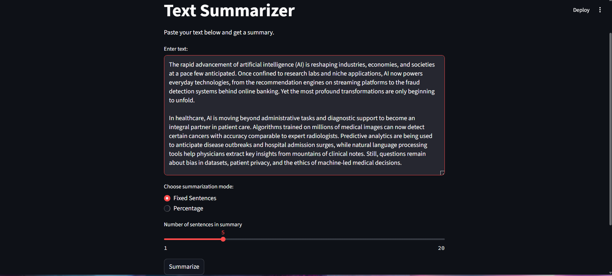
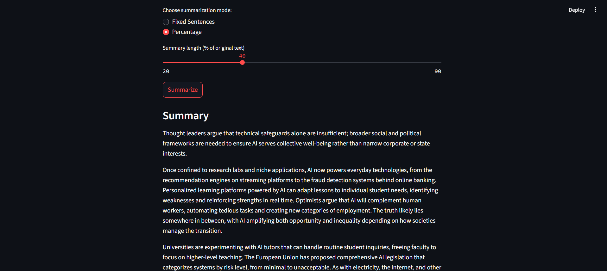

# WordSqueeze (Text Summarizer)

WordSqueeze is a simple text summarization tool built with **spaCy** and **Streamlit**. It scores words by frequency, ranks sentences, and generates a concise summary of any input text.  

> Paste text → choose summary size → get a compressed version instantly.

---

## 🔧 What it does
- Accepts raw text input from the user  
- Builds word frequency scores to identify important tokens  
- Ranks sentences based on weighted word scores  
- Generates extractive summaries with customizable length  
- Runs as a clean, interactive Streamlit app  

---

## 🖼️ Demo



---

## 💻 How to run it
```bash
# Clone the repo
git clone https://github.com/yourusername/WordSqueeze.git
cd WordSqueeze

# Create environment (optional but recommended)
python -m venv venv
source venv/bin/activate   # On Windows use venv\Scripts\activate

# Install dependencies
pip install -r requirements.txt

# Download spaCy model
python -m spacy download en_core_web_sm

# Run the app
streamlit run app.py
